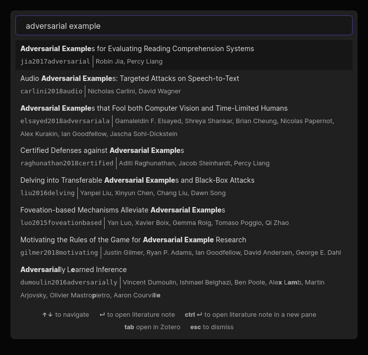

# obsidian-citation-plugin

This plugin for [Obsidian](https://obsidian.md) integrates your academic reference manager with the Obsidian editing experience.



The plugin supports reading bibliographies in [BibTeX / BibLaTeX `.bib` format][4] and [CSL-JSON format][1].

## Setup

You can install this plugin via the Obsidian "Third-party plugin interface." It requires Obsidian 0.9.20 or higher.

Once the plugin is installed, you must provide it with a bibliography file:

- If you use **Zotero** with [Better BibTeX][2]:
  - Select a collection in Zotero's left sidebar that you want to export.
  - Click `File` -> `Export library ...`. Select `Better BibLaTeX` or `Better CSL JSON` as the format. (We recommend using the BibLaTeX export unless you experience performance issues. The BibLaTeX format includes more information that you can reference from Obsidian, such as associated PDF attachments, but loads more slowly than the JSON export.)
  - You can optionally choose "Keep updated" to automatically re-export the collection -- this is recommended!
- If you use other reference managers, check their documentation for BibLaTeX or CSL-JSON export support. We plan to officially support other managers in the future.

Now open the Obsidian preferences and view the "Citations" tab. Paste the path to the exported file (`.bib` or `.json`, depending on the format you chose) in the text field labeled "Citation export path." After closing the settings dialog, you should now be able to search your references from within Obsidian!

## Usage

The plugin offers four simple features at the moment:

1. **Open literature note** (<kbd>Ctrl</kbd>+<kbd>Shift</kbd>+<kbd>O</kbd>): automatically create or open a literature note for a particular reference. The title, folder, and initial content of the note can be configured in the plugin settings.
2. **Insert literature note reference** (<kbd>Ctrl</kbd>+<kbd>Shift</kbd>+<kbd>E</kbd>): insert a link to the literature note corresponding to a particular reference.
3. **Insert literature note content in the current pane** (no hotkey by default): insert content describing a particular reference into the current pane. (This can be useful for updating literature notes you already have but which are missing reference information.)
4. **Insert Markdown citation** (no hotkey by default): insert a [Pandoc-style citation][3] for a particular reference. (The exact format of the citation can be configured in the plugin settings.)

### Templates
You can set up your own template for both the title and content of literature notes. The following variables can be used:

```
* {{citekey}}
* {{abstract}}
* {{authorString}}
* {{containerTitle}}
* {{DOI}}
* {{eprint}}
* {{eprinttype}}
* {{eventPlace}}
* {{page}}
* {{publisher}}
* {{publisherPlace}}
* {{title}}
* {{titleShort}}
* {{URL}}
* {{year}}
* {{zoteroSelectURI}}
```
For example, your literature note title template can simply be `@{{citekey}}` and the content template can look like:
```
---
title: {{title}}
authors: {{authorString}}
year: {{year}}
---
{{abstract}}
```

## License

MIT License.

## Contributors

- Jon Gauthier ([hans](https://github.com/hans))
- [raineszm](https://github.com/raineszm)
- [Luke Murray](https://lukesmurray.com/)

[1]: https://github.com/citation-style-language/schema#csl-json-schema
[2]: https://retorque.re/zotero-better-bibtex/
[3]: https://pandoc.org/MANUAL.html#extension-citations
[4]: http://www.bibtex.org/
